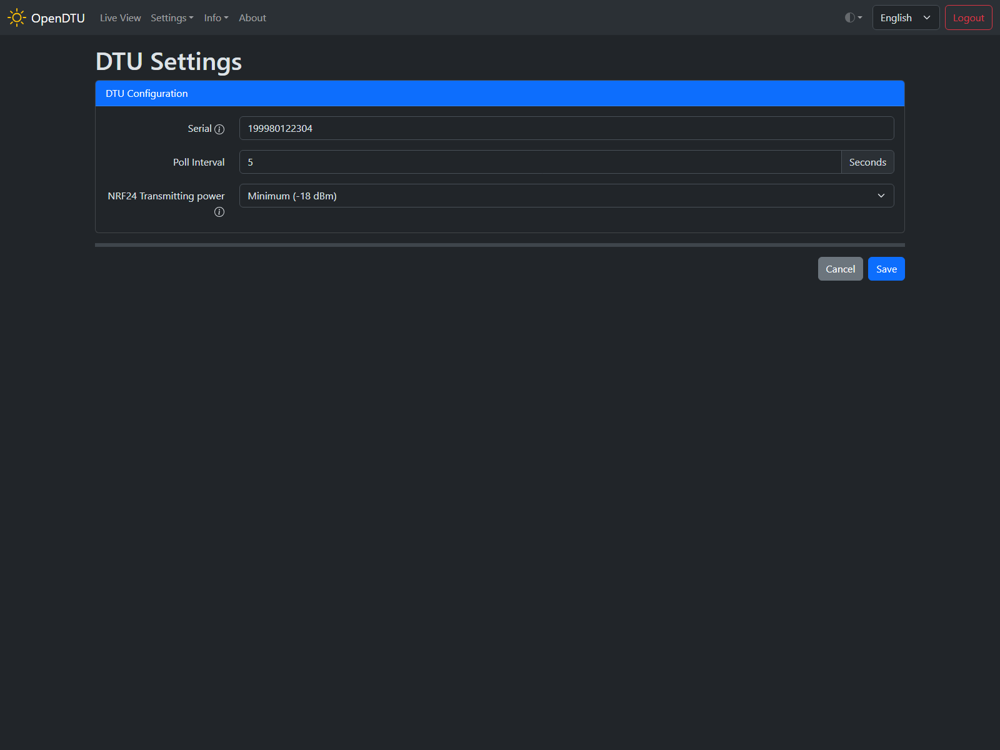
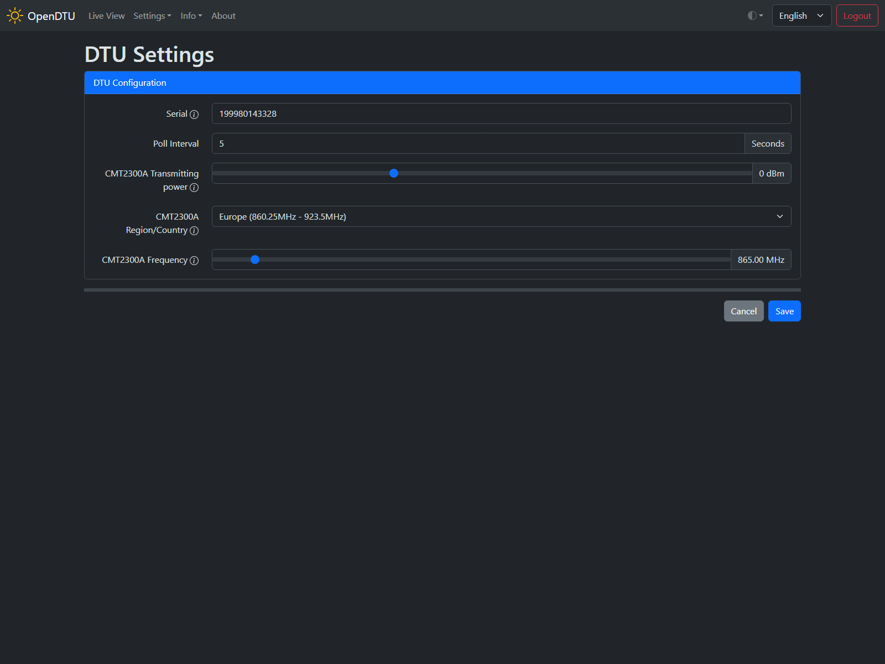

# DTU Settings

## Screenshot

## Settings / Parameters

The possible settings depend on the RF module ([NRF24L01+](../../hardware/nrf24l01plus.md) or [CMT2300A](../../hardware/cmt2300a.md)) used. If you have configured both modules in your [Device Profile](../device_profiles.md), the settings for both modules will appear.

### DTU Configuration

#### Serial :material-form-textbox:{title="Textbox"}

The serial of the DTU which is used to communicate with the inverters. It's like the inverter serial number but belongs to the DTU. A random number is generated on the first start of the OpenDTU and persisted in the configuration. It is important that all the DTU's in RF[^1] range have different serial numbers.

#### Poll Interval: :material-form-textbox:{title="Textbox"}

The time (in seconds) between the individual inverter queries. If you choose this value to small the ESP does not have enough time to perform other tasks.

#### NRF24 Transmitting power :material-form-dropdown:{title="Dropdown"}

Specify the transmit power of the RF module. Choose it according to the phrase: "As large as necessary, as small as possible."
If you select a value that is too high, the power supply unit may not be able to supply enough current (especially low-cost power supply units are affected). Additional capacitors on the RF module can help here.

Possible values:

* Minimum (-18dBm)
* Low (-12dBm)
* High (-6dBm)
* Maximum (0dBm)

!!! warning "Warning"

    Please make sure the maximum transmission power does not exeed you local regulations!

#### CMT2300A Transmitting power :material-tune-variant:{title="Slider"}

Please see [NRF24 Transmitting power](#nrf24-transmitting-power). There is a more granular setting option.

#### CMT2300A frequency :material-tune-variant:{title="Slider"}

After starting an HMS/HMT inverter (or after 15 minutes without communication), it listens on a frequency of 865 MHz in Europe or 915 MHz for US devices (-NA).
In Europe, the DTU must change this frequency before further communication. This is the value that can be set here. If communication with the inverter is not possible, it is possible that radio communication is already taking place on the corresponding frequency. In this case, the value must be adjusted slightly.
For US devices, this value must be permanently set to 915 MHz.

!!! warning "Warning"

    Please check your local regulations if you are allowed to send on the choosen frequency with the specified transmit power!

[^1]: [Radio frequency](https://en.wikipedia.org/wiki/Radio_frequency){target=_blank}
