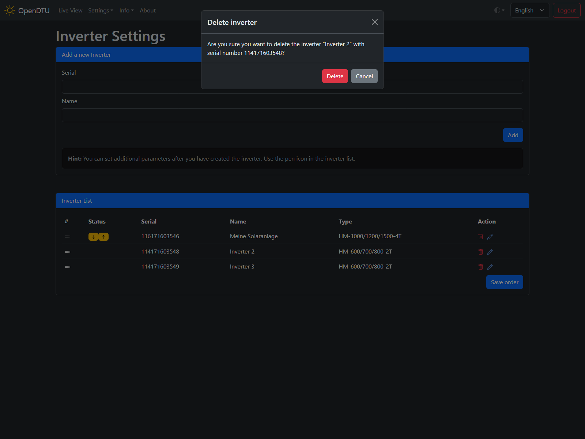

# Inverter Settings

## Screenshot

## Settings / Parameters

### Add new Inverter

#### Serial :material-form-textbox:{title="Textbox"}

The unique serial number of the inverter. It can be found on a lable at the backside of the inverter.

#### Name :material-form-textbox:{title="Textbox"}

A custom name that identifies the inverter. You can choose whatever you want.

### Inverter List

#### Table columns :material-table-lock:{title="Read only Table"}

| Name   | Description |
| ------ | ----------- |
| #      | Grips to change the order of the inverters in the Live View |
| Status | Indicates whether Poll and Send are enabled. Yellow means only during the day, black also at night.<ul><li>:material-arrow-down: Poll</li><li>:material-arrow-up: Send</li></ul> |
| Serial | Serial number |
| Name   | Custom name |
| Type   | The detected inverter type based on the serial number. If you get `Unknown` in this column you either misstyped the number or your inverter is not yet supported. |

#### Save order :material-button-cursor:{title="Button"}

If you changed the order of the inverters using the grips in the first column you can save the new order here.

### Edit Inverter

Press the blue pen to edit the inverter.

#### General

##### Inverter Serial :material-form-textbox:{title="Textbox"}

The serial number of the inverter (see [here](#serial))

##### Inverter Name :material-form-textbox:{title="Textbox"}

The custom name of the inverter (see [here](#name))

##### Poll inverter data :material-toggle-switch:{title="Switch"}

When enabled, the inverter gets polled for data during the day. Day and Night is calculated using the current time and the location specified at [NTP Configuration](ntp_settings.md#location-configuration).

##### Poll inverter data at night :material-toggle-switch:{title="Switch"}

When enabled, the inverter gets also polled at night times.

##### Send commands :material-toggle-switch:{title="Switch"}

When enabled, control commands (e.g. restart/poweroff/limit) will be send to the inverter. Otherwise the commands get dropped.

##### Send commands at night :material-toggle-switch:{title="Switch"}

When enabled, control commands are also send at night. Otherwise the commands get dropped.

#### String

##### Name string \[1-x\] :material-form-textbox:{title="Textbox"}

A custom name for the specific input. You can choose whatever you want. If you leave it empty the name is just `String [1-x]`.

##### Max power string \[1-x\] :material-form-textbox:{title="Textbox"}

Enter the power of the connected solar panel on the specific input. This value is used to calculate the "Irradiation" in the live view.

##### Yield total offset string \[1-x\] :material-form-textbox:{title="Textbox"}

The value entered will be added to the received "Yield Total" value from the inverter. The value can also be negative. With this parameter it is possible, for example, to zero the yield at the beginning of the year (or for a used purchase) or to set it to a specific value. The total yield in the inverter cannot be reset. Comparable to the total kilometre display in a car. Therefore the offset is just set within the DTU.

#### Advanced

##### Reachable Threshold :material-form-textbox:{title="Textbox"}

Number of failed poll requests until the inverter is shown as offline.

##### Zero runtime data :material-toggle-switch:{title="Switch"}

Sets runtime data (like current power, voltage, temperature, frequency but NO yield data) to zero when the inverter gets unreachable.

##### Zero daily yield at midnight :material-toggle-switch:{title="Switch"}

Sets runtime data (like current power, voltage, temperature, frequency but NO yield data) to zero at midnight.

##### Yield Day Correction :material-toggle-switch:{title="Switch"}

By default, the daily yield is reset when the inverter is restarted. This is handled at the inverter itself. On a cloudy day it can happen that the inverter restarts multiple times during dawn. This leads to the effect that the daily yield is already displayed as zero in the evening. If this setting is activated, the DTU remembers the totalised daily yield value generated (between restarts of the inverter) until midnight.

### Delete Inverter

Press the red waste bin to delete an inverter.

#### Delete :material-button-cursor:{title="Button"}

Deletes the currently selected inverter.

#### Cancel :material-button-cursor:{title="Button"}

Returns to the previous view without deleting the inverter.
