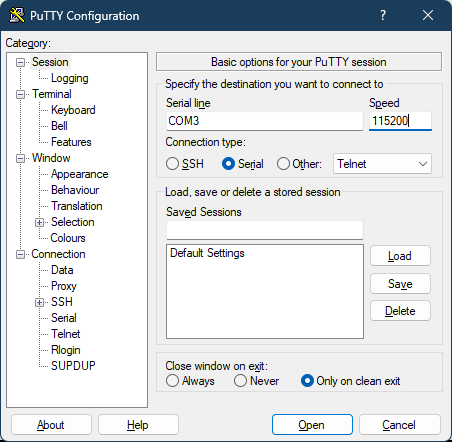

# Frequently Asked Questions

## :question: How to observe the ESP32 boot process by looking at the serial console?

The serial console which is shown in the WebUI does not show the whole boot process and also not several very critical errors. (Just because in such moments the TCP connection is also interrupted). There are several ways to look at the serial console. First of all, the ESP32 has to be connected via an USB cable to the computer.

* If you are using Windows and installed a pre-compiled .bin file you can use e.g. [Putty](https://www.chiark.greenend.org.uk/~sgtatham/putty/latest.html){target=_blank}
    * Download the putty.exe file and run it.
    * Enter the correct serial port (e.g. COM3) and the right baud rate: 115200
    
    * Then press "Open"

* If you are compiling the source by yourself using VS Code you can just press the "Serial Monitor" button in the status bar
  {align=right}

## :question: After a firmwware update some new features do not appear in the web interface

Make sure you reloaded the webinterface after the firmware update. This can be achieved, depending on your browser, by pressing either ++f5++, ++ctrl+f5++ or just by clicking on the reload button.

## :question: After a firmwware does not get a proper IP via DHCP

In some cases it is required to perform a power cycle to get it working again.

## :question: A set up inverter does not appear in the live view

Double check whether the inverter type in **Settings** --> **Inverter** reflects your type or if it's unknown. If it's unknown it will not appear in the live view and you most likely inserted a invalid serial number.

## :question: Is it possible to reset the yield total value?

The yield total value comes directly out of the inverter. (Currently) there is no way to reset or change this value. Please consider it as the total kilometer counter in a car. On the other hand it's possible to add a yield offset to each inverter. This can be set up in the inverter properties (**Settings** --> **Inverters** --> **Click on the pen icon**)

## :question: Why get the daily yield values sometimes reset to zero at the evening?

The values are reset if the inverter restarts. At some (cloudy) evenings it can occur that the brightness fluctuates heavily during the dusk. This could lead to multiple restarts of the inverter and therefor zeros in the production values. You can enable the **Yield Day Correction** in the inverter settings.

## :question: OpenDTU shows wrong/unrealistic or just missing values

This is most likely the case because two DTUs are querying the same inverter. This is a not supported behavior and can lead to unexpected effects. Only one DTU is allowed to query a specific inverter.

Please also see [#831](https://github.com/tbnobody/OpenDTU/issues/831){target=_blank}, [#727](https://github.com//tbnobody/OpenDTU/issues/727){target=_blank}

## :question: With HMS-1800 or HMS-2000 the reactive power shows unrealistic value 6.553,5

This seems to be a issue with inverter Firmware 1.0.14. It contains a calculation mistake.

Reactive power seems to scale incorrectly / be calculated incorrectly and runs up with increasing power at sunrise from 0 to 0xFFFF and remains there, which can be observed at slow sunrise and sunset again (only in the very low watt range). Since the PF is calculated from P and Q and Q is insanely high, this results in a PF of almost 0.

Please also see [#926](https://github.com/tbnobody/OpenDTU/issues/926){target=_blank}

## :question: OpenDTU does not build: "error: 'bad_alloc' was not declared in this scope"

The exact reason is not known. But it helps to delete the `~/.platformio/` folder.

Please also see [#719](https://github.com/tbnobody/OpenDTU/issues/719){target=_blank}