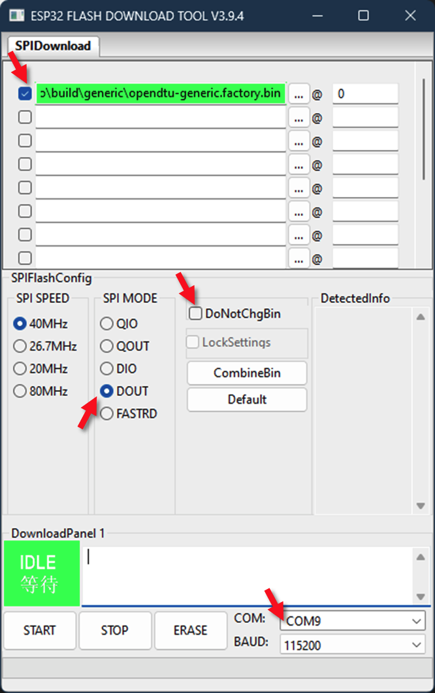

# Flash ESP32

## Download Firmware

The pre-compiled binary files can be found on the GitHub [Releases Page](https://github.com/tbnobody/OpenDTU/releases) (the right column on the projects start page). Currently there are pre-compiled binaries for ESP32 and ESP32-S3 MCUs.

### Overview of pre-compiled binaries

| Binary                                  | MCU                | Device Profile mandatory | First Flash / OTA | Comment     |
| --------------------------------------- | ------------------ | ------------------------ | ----------------- | ----------- |
| opendtu-generic.bin                     | ESP32              | No                       | OTA               | Deprecated! |
| opendtu-generic.factory.bin             | ESP32              | No                       | First Flash       | Deprecated! |
| opendtu-generic_esp32.bin               | ESP32              | Yes                      | OTA               |             |
| opendtu-generic_esp32.factory.bin       | ESP32              | Yes                      | First Flash       |             |
| opendtu-generic_esp32s3.bin             | ESP32-S3           | Yes                      | OTA               | For boards with usb-uart bridge |
| opendtu-generic_esp32s3.factory.bin     | ESP32-S3           | Yes                      | First Flash       | For boards with usb-uart bridge |
| opendtu-generic_esp32s3_usb.bin         | ESP32-S3           | Yes                      | OTA               | For boards with integrated usb connection |
| opendtu-generic_esp32s3_usb.factory.bin | ESP32-S3           | Yes                      | First Flash       | For boards with integrated usb connection |

!!! note "Note"
    All pre-compiled binaries require a mandatory [Device Profile](device_profiles.md). You have to upload one after flashing the firmware!

## Flash ESP32

!!! danger "Important"
    When flashing OpenDTU onto the ESP32 for the first time, you need to flash it over serial using the **factory** firmware binary file.
    You need to write the factory binary to the ESP32 flash chip at address `0x0`.

    The factory binary also contains a bootloader and partition scheme needed to properly boot the ESP32.

Before starting the flash process you have to put the ESP into *flash mode*. Most boards are able to do this automatically but sometimes it's not working:

1. Connect `GPIO0` to `GND` before booting the device
2. Power-on or reset the ESP32 while `GPIO0` is connected to `GND`
3. Start the flash process

The actual procedure to flash the ESP32 depends on the tool used. Click on the tab below that matches your flash tool.

=== "ESP Flash Tools :material-microsoft-windows:"
    Espressif provides their own [Flash Download Tools](https://www.espressif.com/en/support/download/other-tools){target=_blank} for Windows.

    

    Change `COM9` to the correct port on your computer.

    * On startup, select Chip Type --> **ESP32** and WorkMode -> **Develop**
    * Prepare all settings (see picture). Make sure to uncheck the **DoNotChgBin** option. Otherwise you may get errors like "invalid header".
    * Press "Erase" button on screen. Look into the terminal window, you should see dots appear. On some boards, the automatic bootloader selection does not work. In this case you have to manually press the "Boot" button on the ESP32 board. Wait for "FINISH" to see if flashing/erasing is done.
    * To program, press "Start" on screen, then the "Boot" button (if required).
    * When flashing is complete (FINISH appears) then press the Reset button on the ESP32 board (or powercycle ) to start the OpenDTU application.

=== "ESPtool.py :material-linux::material-apple::material-microsoft-windows:"
    ```sh linenums="1"
    esptool.py --port COM1 erase_flash
    esptool.py --port COM1 --chip esp32 --before default_reset --after hard_reset \
        write_flash --flash_mode dout --flash_freq 40m --flash_size detect \
        0x0 opendtu-generic*.factory.bin
    ```

    Change `COM1` to the correct port on your computer. If you get an error at the end of the flash procedure, you can try with a lower the baudrate eg. 460800.

=== "ESP_Flasher Web :material-linux::material-apple::material-microsoft-windows:"

    [ESP_Flasher](https://espressif.github.io/esptool-js/) - web version

    It is also possible to flash it via the web tools which might be more convenient and is platform independent.

=== "ESP_Flasher :material-microsoft-windows:"

    Users report that [ESP_Flasher](https://github.com/Jason2866/ESP_Flasher/releases/){target=_blank} is suitable for flashing OpenDTU on Windows.
