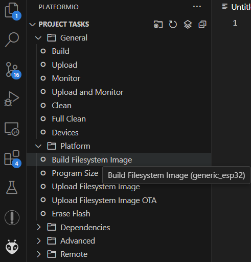

# Generate pre-configured image

## Introduction

This howto explains how to generate a image (`.bin` file) containing a custom `pin_mapping.json` or pre-configured `config.json`. You have to compile OpenDTU using [VSCode](../compile_vscode.md).

## Generate Filesystem image

All configuration is placed in the so called "Filesystem Image". The image can be generated manually by creating a folder called `data` in the main directory of OpenDTU (where the `platformio.ini` is located). Then call the OpenDTU function "Build Filesystem Image" from the Project Tasks. It will generate file called `littlefs.bin` in the `.pio/build/<environment>` folder. The `littlefs.bin` file has to be flashed on address `0x3D0000` on the ESP (see [Partition Table](#partition-table) below).



## Integrate filesystem into factory.bin

The `esptool.py` command can be used to manually generate a `.factory.bin` file which already contains the `littlefs.bin`.

A sample command for ESP32 would be:

```bash
esptool.py \
--chip esp32 merge_bin \
-o custom_firmware.factory.bin \
--flash_mode dio \
--flash_freq 40m \
--flash_size 4MB \
0x1000 bootloader.bin \
0x8000 partitions.bin \
0xe000 boot_app0.bin \
0x10000 firmware.bin \
0x3d0000 littlefs.bin
```

This command has to be executed in the `.pio/build/<environment>` folder. It will output a file called `custom_firmware.factory.bin`.

## Partition Table

| Name    | Type | SubType | Offset   | Size     | Flags |
| ------- | ---- | ------- |--------- | -------- | ----- |
| nvs     | data | nvs     | 0x9000   | 0x5000   |       |
| otadata | data | ota     | 0xe000   | 0x2000   |       |
| app0    | app  | ota_0   | 0x10000  | 0x1E0000 |       |
| app1    | app  | ota_1   | 0x1F0000 | 0x1E0000 |       |
| spiffs  | data | spiffs  | 0x3D0000 | 0x30000  |       |

## Contents of the data folder

The `data` folder should contain the following files:

* `pin_mapping.json`
* `config.json`

The contents of the `pin_mapping.json` can be obtained [here](../device_profiles.md).

The `config.json` should contain at least the following content:

```json
{
    "cfg": {
        "version": 72448
    },
    "device": {
        "pinmapping": "<Name of device profile>"
    }
}
```

But of course you can set all other required settings. If no value is specified for a setting, the default values are used.
