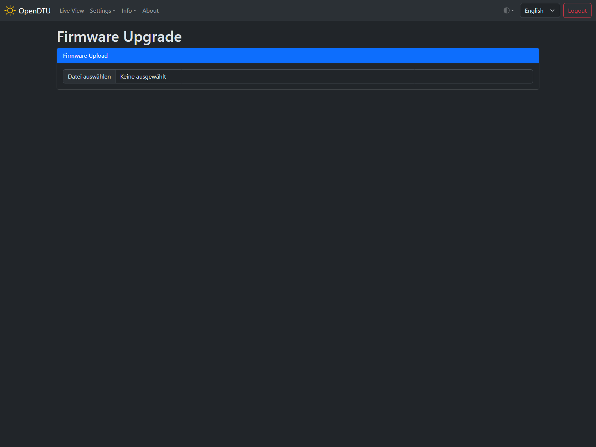

# Firmware Update

## Firmware Variant

You can find your currently installed firmware variant in **Info** -->
**System** --> **PIO Environment**.

## Over-The-Air (OTA)

!!! danger "Factory Images"
    Do **NOT** use a factory firmware image to perform an OTA update. The
    device will not boot after writing a factory firmware image using OTA.

Once OpenDTU is running and connected to Wi-Fi, you can do further
updates using the web interface. Navigate to **Settings** --> **Firmware
upgrade** and press the browse button. Select an appropriate firmware file from
your local computer.

If you've installed a pre-compiled firmware in the past (a firmware file which
contains `opendtu-generic*.factory.bin` in its filename), choose the
respective binary without the suffix `.factory` when performing an OTA update.

If you have compiled the firmware by yourself, you'll find the firmware file (after a successful build process) under `.pio/build/<environment>/firmware.bin`, where `<environment>` is your chosen PlatformIO environment, e.g., `generic_esp32`.

After a successful upload, OpenDTU immediately restarts using the new firmware.

!!! danger "Important hint"
    Make sure you reload the web interface after the update. Otherwise you will not see new settings and features. Normally it should be sufficient to reload the page with ++f5++ or by clicking on "Refresh". In some cases it may also be necessary to clear the browser cache. This can be done with the key combination ++ctrl+f5++, for example.

## Serial Update

### Using VSCode

If you've uploaded the firmware in the past using VSCode you can just follow the [compiling guide](compile_vscode.md) to upload it again. All settings are preserved.

### Using flash tool

Flash the appropriate factory firmware image (the binary with `.factory` in its
name) to address `0x0` using `esptool.py` or a similar tool, see [description
of writing to ESP32 flash](flash_esp.md).
